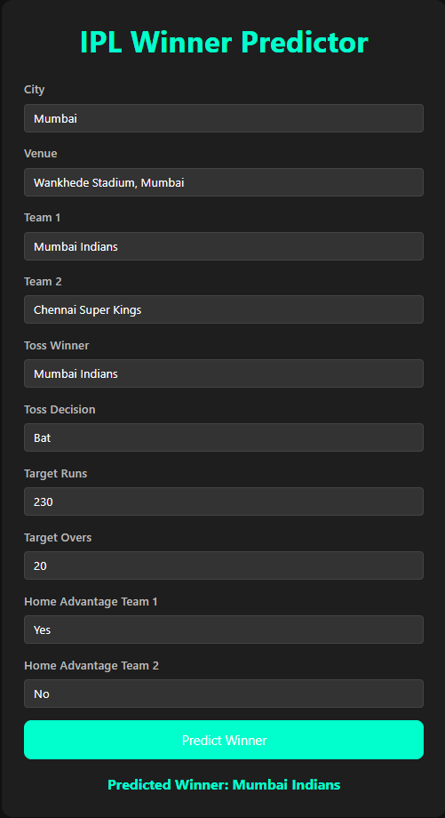

# 🏏 Dream11 IPL Winning Team Predictor

Predict the winning team of a Dream11 IPL match using machine learning with XGBoost, Python, Flask, and data from Kaggle (2008–2024). Deployed live using Render!

## 🚀 Live Demo

🌐 [Visit Live App](https://dream11-winning-team-prediction-g41k.onrender.com)  

---

## 📌 Project Overview

This project is a machine learning-based web app that predicts the **winning team** in an IPL Dream11 match based on match metadata like teams, venue, toss decision, target runs, and more. The model is trained using historical IPL data and is powered by **XGBoost**, with a **Flask** backend and deployed on **Render**.



---

## 🧠 ML Model

- **Algorithm:** XGBoost Classifier
- **Input Features:**
  - City
  - Venue
  - Team 1 & Team 2
  - Toss Winner
  - Toss Decision
  - Target Runs
  - Target Overs
  - Home Advantage (Team 1 & Team 2)
- **Output:** Predicted Winning Team

Model is trained using IPL match data from **2008–2024**, available on [Kaggle](https://www.kaggle.com/datasets/patrickb1912/ipl-complete-dataset-20082020).

---

## ⚙️ Tech Stack

| Area            | Tech                            |
|-----------------|----------------------------------|
| Language        | Python                           |
| Backend         | Flask                            |
| Machine Learning| XGBoost                          |
| Dataset         | IPL Kaggle Dataset (2008–2024)   |
| Deployment      | Render                           |
| Frontend        | HTML (Jinja2 Template: `index4.html`) |

---

## 🖥️ App Functionality

- Dropdowns populated dynamically using unique team, venue, and city values.
- Predicts winner based on match conditions.
- Displays predicted winner instantly using API call.

---

## 📁 Project Structure

```
├── app.py                # Main Flask application
├── model.pkl             # Trained XGBoost model
├── matches.csv           # IPL match dataset
├── templates/
│   └── index4.html       # Web interface
├── requirements.txt      # Python dependencies
└── README.md             # Project overview
```

---

## 🔧 How to Run Locally

```bash
# 1. Clone the repo
git clone https://github.com/PrathameshPC77/dream11_winning_team_prediction.git
cd dream11_winning_team_prediction

# 2. Create virtual environment
python -m venv venv
source venv/bin/activate  # For Windows: venv/Scripts/activate

# 3. Install dependencies
pip install -r requirements.txt

# 4. Run the app
python app.py
```

App will run on `http://localhost:5000`

---

## 📦 Deployment

- Deployed using [Render](https://render.com/)
- Configured `app.py` to run on dynamic `PORT` and `0.0.0.0` host for cloud deployment

---

## 🤝 Credits

- **Dataset:** [Kaggle IPL Dataset 2008–2024](https://www.kaggle.com/datasets/patrickb1912/ipl-complete-dataset-20082020)
- **Bootcamp by:** DevTown

---

## 🧑‍💻 Author

**Prathamesh Chikankar**  
🚀 Passionate about AI, ML, and backend systems  
📫 [LinkedIn](https://www.linkedin.com/in/prathamesh-c-1b8539223) | [GitHub](https://github.com/PrathameshPC77)

---

## 📌 Future Enhancements

- Add probability/confidence score for predictions
- UI improvements
- Expand model with player-level stats
